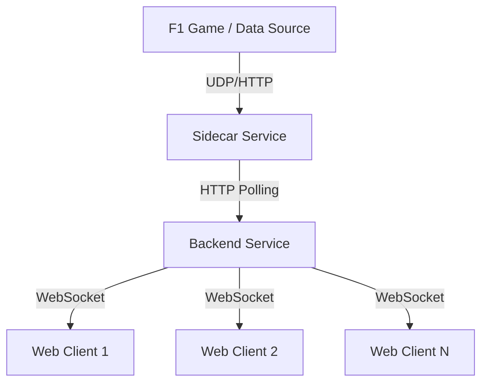

# F1 Telemetry Backend

Backend service for a real-time Formula 1 telemetry dashboard, built with Go and designed for high performance and scalability.

## Overview

This service acts as the central hub for F1 telemetry data. It ingests data from a sidecar service (which interfaces with the F1 game or data provider) and broadcasts it to connected clients via WebSockets.

## Architecture



## Prerequisites

- **Go**: 1.24+
- **Docker**: For containerized execution
- **Nix** (Optional): For reproducible builds

## Getting Started

### Local Development

1.  **Clone the repository:**
    ```bash
    git clone https://github.com/peri-Bot/f1-telemetry-backend.git
    cd f1-telemetry-backend
    ```

2.  **Run the server:**
    ```bash
    make run
    ```
    The server will start on port `8080`.

3.  **Run tests:**
    ```bash
    make test
    ```

4.  **Run linter:**
    ```bash
    make lint
    ```

### Docker

Build the Docker image:
```bash
make docker-build
```

## API Documentation

### HTTP Endpoints

-   `GET /`: Health check. Returns `Backend server is running`.

### WebSocket

-   `GET /ws`: WebSocket endpoint for real-time telemetry data.

## Project Structure

-   `cmd/server`: Application entry point.
-   `internal`: Internal application logic (polling, websocket hub).
-   `sidecar`: Python sidecar for data ingestion.
-   `.github/workflows`: CI/CD pipelines.
