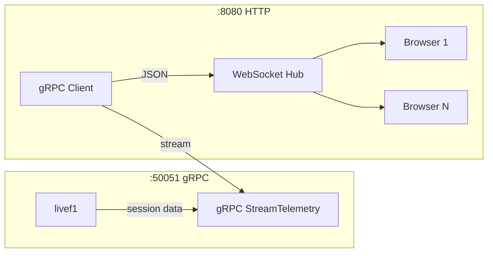

# F1 Telemetry Backend

Real-time Formula 1 telemetry backend built with **Go** and **gRPC**. Streams live car data from a Python sidecar to connected browser clients via WebSockets.

## Architecture


```mermaid
graph LR
    subgraph Python Sidecar [:50051 gRPC]
        A[livef1] -->|session data| B[gRPC StreamTelemetry]
    end
    subgraph Go Backend [:8080 HTTP]
        C[gRPC Client] -->|stream| B
        C -->|JSON| D[WebSocket Hub]
        D --> E[Browser 1]
        D --> F[Browser N]
    end
```

The **sidecar** loads F1 session data via [livef1](https://github.com/GoktugOcal/LiveF1) and exposes a gRPC server-streaming RPC (`StreamTelemetry`). The **backend** subscribes to the stream, converts each `TelemetryBatch` to JSON, and broadcasts it to all WebSocket clients.

## Prerequisites

- [Nix](https://nixos.org/download.html) (provides Go 1.24, Python 3.11, protobuf tooling)
- [Docker](https://docs.docker.com/get-docker/) (optional, for containerized runs)

## Getting Started

### 1. Enter the dev shell

```bash
nix develop
```

This gives you Go, Python, `protoc`, `protoc-gen-go`, and `protoc-gen-go-grpc`.

### 2. Generate protobuf stubs

```bash
make proto
```

Generates Go stubs in `proto/gen/telemetrypb/` and Python stubs in `sidecar/proto/`.

### 3. Run locally

```bash
# Terminal 1 — start the sidecar
python sidecar/data_forwarder.py

# Terminal 2 — start the backend
make run
```

Or use Docker Compose:

```bash
docker compose up --build
```

### 4. Run tests

```bash
make test          # or: go test -v -race ./...
```

### 5. Lint

```bash
make lint
```

## Proto Definition

The service contract is defined in [`proto/telemetry.proto`](proto/telemetry.proto):

| Message          | Description                                       |
| ---------------- | ------------------------------------------------- |
| `CarData`        | Speed, RPM, gear, throttle, brake, DRS            |
| `Position`       | X/Y/Z coordinates, on-track status                |
| `DriverUpdate`   | One driver's car data + position                  |
| `TelemetryBatch` | All drivers in a single tick (streamed at ~10 Hz) |
| `StreamRequest`  | Empty request to initiate the server stream       |

```protobuf
service TelemetryService {
  rpc StreamTelemetry(StreamRequest) returns (stream TelemetryBatch);
}
```

## API

| Endpoint      | Protocol  | Description                     |
| ------------- | --------- | ------------------------------- |
| `GET /health` | HTTP      | Health check — returns `OK`     |
| `GET /ws`     | WebSocket | Real-time telemetry JSON stream |
| `GET /`       | HTTP      | Static frontend files           |

## Environment Variables

| Variable            | Default           | Description                            |
| ------------------- | ----------------- | -------------------------------------- |
| `SIDECAR_GRPC_ADDR` | `localhost:50051` | gRPC address of the sidecar            |
| `PORT`              | `8080`            | HTTP listen port for the backend       |
| `ALLOWED_ORIGINS`   | `*`               | CORS allowed origins (comma-separated) |
| `GRPC_PORT`         | `50051`           | gRPC listen port for the sidecar       |

## Project Structure

```
├── cmd/server/          # Application entry point
├── internal/
│   ├── grpcclient/      # gRPC stream consumer (connects to sidecar)
│   └── websocket/       # WebSocket hub + client management
├── models/              # JSON-tagged telemetry structs + FromProto()
├── proto/
│   ├── telemetry.proto  # Service contract
│   └── gen/telemetrypb/ # Generated Go stubs (not committed)
├── sidecar/
│   ├── data_forwarder.py  # Python gRPC server
│   └── proto/             # Generated Python stubs (not committed)
├── k8s/                 # Kubernetes manifests
├── Dockerfile.backend   # Multi-stage Nix build → scratch image
├── Dockerfile.sidecar   # Multi-stage Nix build → scratch image
├── docker-compose.yaml  # Local dev: sidecar + backend
├── flake.nix            # Nix flake (builds, dev shell, proto codegen)
└── Makefile             # Build, test, lint, proto, docker, k8s targets
```

## Nix Builds

```bash
nix build .#backend   # Go binary (proto stubs generated in preBuild)
nix build .#sidecar   # Python runtime bundle
```

## Kubernetes

```bash
make k8s-deploy       # Applies namespace + sidecar + backend manifests
make k8s-delete       # Tears down the namespace
```

The sidecar uses native **gRPC health probes** (K8s 1.24+). The backend uses standard HTTP `/health` probes.

## License

See [LICENSE](LICENSE) for details.
